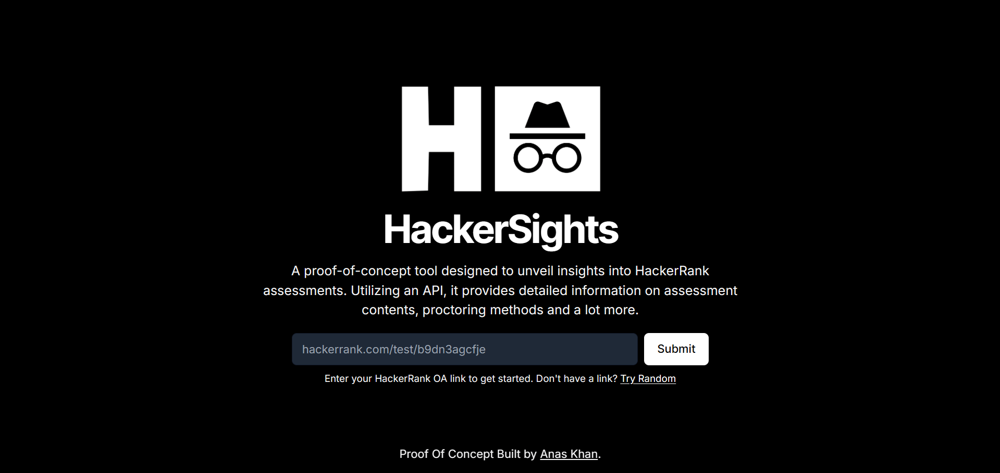
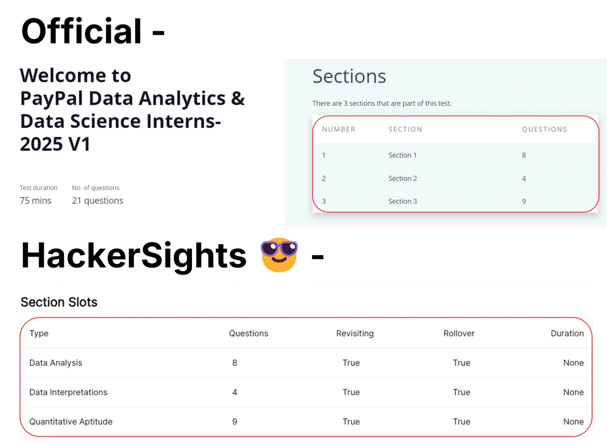
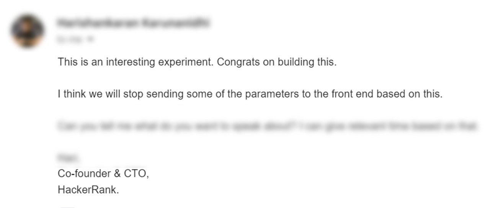

# HackerSights 🕶️

A groundbreaking proof-of-concept tool designed to unveil comprehensive insights into online assessments (OA). Whether you're planning for a coding challenge or a technical test, **HackerSights** helps you get the edge by providing vital information beforehand.

## ✨ Features

### What HackerSights Can Do for You:

- **📊 Cutoff Score**: Understand the scoring criteria before attempting.
- **🔍 ML Plagiarism Detection**: Learn about the level of plagiarism scrutiny.
- **📽️ Video Proctoring**: Know if and how you'll be monitored visually.
- **📋 Copy-Pasting Monitoring**: Be aware of clipboard activity tracking.
- **🖥️ Multi-Monitor Detection**: Check if switching screens is flagged.
- **💡 Much, Much More**: Explore a plethora of other insightful details about your OA experience.

### Why HackerSights?

- **🔍 Explore All Necessary Info:** From proctoring methods to assessment logistics, prepare effectively.
- **⏰ Plan Wisely:** Start on your terms by knowing the right time and environment for your test.
- **🕵️ Fully Anonymous:** No personal data required.
- **🔓 Open Access:** Works on both current and upcoming OA links.
- **🔑 No Authentication Needed:** Start using instantly without logging in.

---

### See it in action!

<!--  -->

https://github.com/user-attachments/assets/ae72f6c5-4d04-4057-b662-9b4736c00345

{: width="500" height="300"}

## 🔗 Try HackerSights Now!

Ready to try it out? Visit the HackerSights website at
[**hackersights.pythonanywhere.com**](https://hackersights.pythonanywhere.com)

---

## 🌐 License

This project is licensed under the [GNU General Public License v3.0](LICENSE). Feel free to use, modify, and distribute responsibly.

---

### Disclaimer

This repository is a showcase and does not contain the actual source code of the tool. This tool is for educational and awareness purposes only.

{: width="250" height="150"}

Please use it responsibly.
The potential concerns with this tool have been communicated to **HackerRank**, and they are actively working on addressing them. Rest assured, this tool is solely for awareness and responsible usage.
